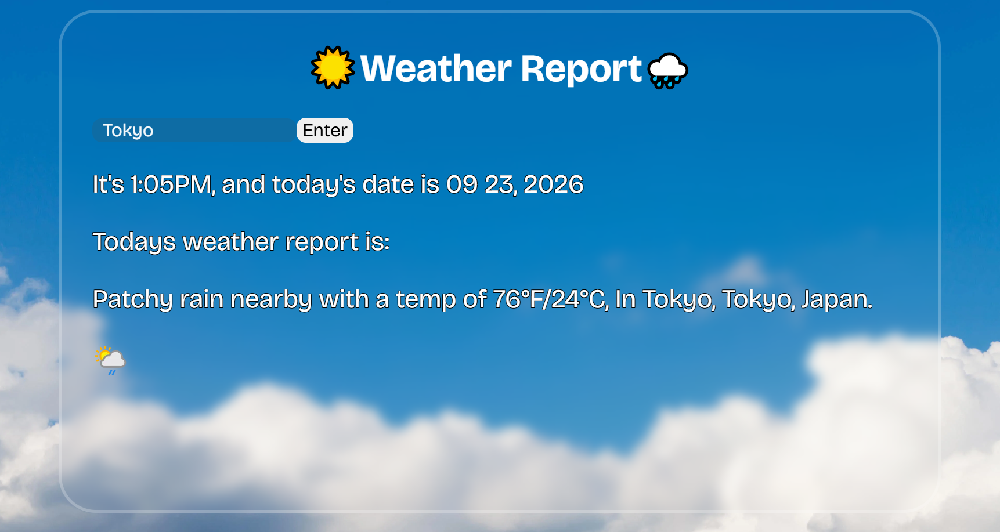

# Weather Report

A simple front-end web app that lets you enter a location and see today's weather report for it, pulled from a weather API.



## How It Works

1. The user types a location into the input and clicks **Enter**.
2. The app sends a request to the weather API with that location.
3. The results are displayed on the page: today's date, the location, the current weather, and a matching weather icon.

## How It's Made

**Tech used:** HTML, CSS, JavaScript

The page is built with HTML and styled with CSS, using the Bricolage Grotesque font from Google Fonts. JavaScript uses the Fetch API to request weather data for the location the user enters, parses the JSON response, and updates the DOM with the results. The code is split across `weather.js` for the API logic and `hide.js` for showing and hiding sections of the page.

## Getting Started

1. Clone the repo:
   ```bash
   git clone https://github.com/exbrto/WeatherAppApi.git
   ```
2. Add your weather API key in `assets/weather.js`, if the API requires one.
3. Open `index.html` in your browser.

## Lessons Learned

- Taking user input and using it to build an API request
- Using `fetch()` to get data from a public API and handling the JSON response
- Updating the DOM dynamically, including showing and hiding elements
- Working with Git branches, forks, and pull requests

## Author

**Erick Brito** – [GitHub](https://github.com/exbrto)

Built as part of the Resilient Coders bootcamp.